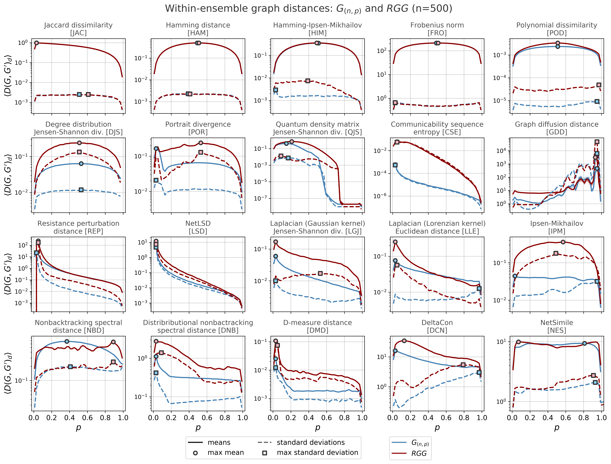

# wegd: The within-ensemble graph distance
Python code for calculating the *within-ensemble graph distance* between networks
sampled from a given graph ensemble, under a number of graph distances.

This code accompanies the paper: 

**Network comparison and the within-ensemble graph distance**\
Harrison Hartle, Brennan Klein, Stefan McCabe, Alexander Daniels,
Guillaume St-Onge, Charles Murphy, and Laurent Hébert-Dufresne.
https://arxiv.org/abs/2008.02415

- - - -

<p align="center">

</p>

**<p align="center">Fig. 1: Mean within-ensemble distances for each distance measure tested.**

## Analysis and Notebooks (works in progress...)

1. [An example](https://github.com/jkbren/wegd/blob/master/code/wegd-example.ipynb)
2. [Sample code for batch experiments on a computing cluster](https://github.com/jkbren/wegd/blob/master/cluster/wegd-scm-gamma.py)


## Requirements  <a name="requirements"/>

This code is written in [Python 3.x](https://www.python.org) and uses 
the standard Python scientific computing stack and [netrd](https://github.com/netsiphd/netrd/)
for implementations of the graph distances.

The specific dependencies are documented in `requirements.txt`.

## Citation   <a name="citation"/>

If you use these methods and this code in your own research, please cite our paper:

Hartle, H., Klein, B., McCabe, S., St-Onge, G., Murphy, C., Daniels, A.,
and Hébert-Dufresne, L. (2020).
**Network comparison and the within-ensemble graph distance.**

Bibtex: 
```text
@article{hartle2020wegd,
  title = {Network comparison and the within-ensemble graph distance},
  author = {Harrison Hartle and Brennan Klein and Stefan McCabe and Alexander Daniels and Guillaume St. Onge and Charles Murphy and Laurent Hébert-Dufresne},
  journal = {arXiv preprint 2008.02415},
  year = {2020}
}
```
